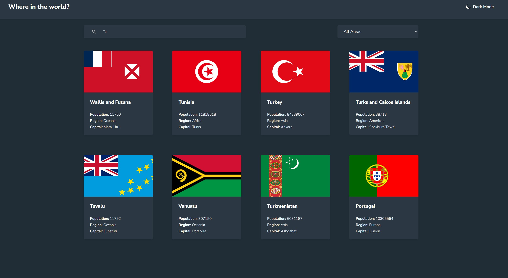

# Rest Countries v2

Bu proje, dünya ülkeleri hakkında detaylı bilgiler sunan modern bir web uygulamasıdır. [REST Countries API](https://restcountries.com) kullanılarak geliştirilmiştir.



## 🚀 Özellikler

- Tüm ülkelerin listesini görüntüleme
- Ülke arama
- Bölgeye göre filtreleme
- Koyu/Açık tema desteği
- Ülke detay sayfası
  - Bayrak
  - Yerel isim
  - Nüfus
  - Bölge ve Alt Bölge
  - Başkent
  - Alan Adı
  - Para Birimi
  - Diller
  - Sınır Komşuları
- Responsive tasarım

## 🛠️ Kullanılan Teknolojiler

- **React** - ^18.3.1
- **Vite** - ^6.0.5
- **ESLint** - ^9.17.0
- **CSS3** - Özel stil ve animasyonlar

## 📁 Proje Yapısı

```
rest-countries-v2/
├── public/
│   └── svg/                # SVG ikonları
├── src/
│   ├── components/         # React bileşenleri
│   │   ├── Country.jsx     # Ülke detay sayfası
│   │   ├── Header.jsx      # Uygulama başlığı ve tema değiştirici
│   │   └── HomePage.jsx    # Ana sayfa ve ülke listesi
│   ├── App.css             # Ana stil dosyası
│   ├── dark-mode.css       # Koyu tema stilleri
│   ├── reset.css           # CSS reset
│   ├── App.jsx             # Ana uygulama bileşeni
│   ├── helper.jsx          # Yardımcı fonksiyonlar
│   └── main.jsx            # Uygulama giriş noktası
└── package.json            # Proje bağımlılıkları ve scriptleri
```

## 🚦 Başlangıç

1. Projeyi klonlayın:

```bash
git clone https://github.com/MrDemirtas/rest-countries-v2.git
cd rest-countries-v2
```

2. Bağımlılıkları yükleyin:

```bash
npm install
```

3. Geliştirme sunucusunu başlatın:

```bash
npm run dev
```

4. Tarayıcınızda açın:

```
http://localhost:5173
```

## 🔨 Kullanılabilir Scriptler

- `npm run dev` - Geliştirme sunucusunu başlatır
- `npm run build` - Üretim için projeyi derler
- `npm run preview` - Derlenmiş projeyi önizler
- `npm run lint` - ESLint ile kod kontrolü yapar

## 🌐 API Kullanımı

Uygulama, [REST Countries API](https://restcountries.com) üzerinden ülke verilerini çeker. API'den alınan veriler şunları içerir:

- Ülke isimleri (yerel ve yaygın)
- Bayraklar (SVG formatında)
- Nüfus bilgileri
- Bölge ve alt bölge bilgileri
- Başkent bilgileri
- Para birimleri
- Diller
- Sınır komşuları

## 🎨 Tema Desteği

Uygulama, kullanıcı tercihine göre açık ve koyu tema desteği sunar:

- Sistem teması ile otomatik senkronizasyon
- Manuel tema değiştirme özelliği
- LocalStorage ile tema tercihi kaydı

## 📱 Responsive Tasarım

Uygulama, tüm ekran boyutlarına uyumlu responsive bir tasarıma sahiptir:

- Mobil öncelikli tasarım
- Esnek grid sistemi
- Uyarlanabilir tipografi
- Duyarlı görüntüler
